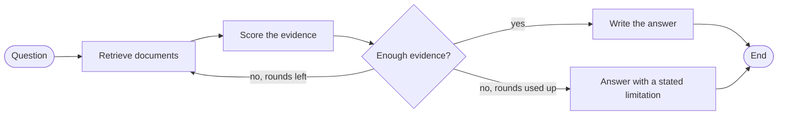

# Learning LangGraph through Literate Notebooks

[](https://github.com/RaquelKehl/learn-langgraph-literate-notebooks/actions/workflows/notebooks.yml)


Seven Jupyter notebooks that teach LangGraph through literate programming,
building one evidence-based research assistant over a fictional finance
corpus: state, reducers, retrieval and scoring, routing, loops, LLM
misjudgement and persistence, with deliberate mistakes checked in CI.

Semester project in the module *Digital Finance: Applications and
Technologies* (DIFA), MSc in Business Information Systems, autumn 2026.

## Why this exists

Most LangGraph tutorials show a finished graph. This series builds one system
step by step and stops at every point where the previous version is no longer
enough: where a linear chain cannot loop back, where two steps overwrite each
other's data, where the evidence is too thin to answer, where a language model
trusts the wrong source. Each notebook explains the idea before the code
appears, then shows at least two typical mistakes with the error they cause
and the fix.

The aim is not a clever assistant. The aim is a clear view of how control
flow, shared state and persistence work in a graph.

## The research assistant

One pattern runs through the whole series:



Scoring follows fixed, readable rules: how many independent sources support a
claim, how authoritative they are, whether they contradict each other, and
whether a source has been superseded. The language model writes the answer;
it never decides which step runs next. NB 06 adds a pause for human approval
when the evidence stays uncertain.

## The notebooks

| # | Notebook | What it answers |
|---|---|---|
| 01 | [Hello LangGraph](notebooks/01_hello_langgraph.ipynb) | What changes when the same step is built as a graph instead of a chain? |
| 02 | [State contract](notebooks/02_state_contract.ipynb) | How do steps share one consistent state, and who may change what? |
| 03 | [Retrieval and scoring](notebooks/03_retrieval_and_scoring.ipynb) | How does the assistant find documents and rate the evidence? |
| 04 | [Conditional routing and loops](notebooks/04_conditional_routing_and_loops.ipynb) | How does it search again when evidence is thin, without looping forever? |
| 05 | [LLM misjudgement](notebooks/05_llm_misjudgement.ipynb) | Where do the rules and the model's own judgement disagree? |
| 06 | [Persistence](notebooks/06_persistence.ipynb) | How does a run pause for human approval and resume where it stopped? |
| 07 | [Synthesis](notebooks/07_synthesis.ipynb) | What are the answers to the four research questions? |

Every notebook has the same eight parts: learning goals, setup, concept,
experiment, common mistakes, prompt log, summary and an exercise.

## The corpus

Twenty short documents in six topic folders under [`data/corpus/`](data/corpus/).
Every company, person, publication and authority in them is fictional. Each
topic hides one test case:

| Topic | Fictional subject | What it tests |
|---|---|---|
| a | Quarterly results of Solvane Dynamics AG | Credible sources against an anonymous forum post with a different revenue figure |
| b | Merger of two private banks | Sources that agree on the facts but disagree in their opinion: not a contradiction |
| c | A new custody circular from a supervisory authority | Only one usable source, which forces the assistant to search again |
| d | An insurer's dividend payout target | A 2023 target replaced in 2025: only the date settles it |
| e | Fees of robo-advisory platforms | Two weak sources agree on a wrong figure because one copies the other |
| f | Village club newsletters | Unrelated documents that share everyday words with finance questions |

## Quick start

You need Python 3.12 and Git. No API key, no GPU, and after installation no
internet connection.

```bash
git clone https://github.com/RaquelKehl/learn-langgraph-literate-notebooks.git
cd learn-langgraph-literate-notebooks
python -m venv .venv
```

Activate the environment (Windows: `.venv\Scripts\activate`; macOS and Linux:
`source .venv/bin/activate`), then:

```bash
pip install -r requirements.txt
pip install -e .
jupyter lab
```

Open the notebooks in order, starting with `notebooks/01_hello_langgraph.ipynb`.
To run every notebook and test in one go:

```bash
pytest
```

## Model modes

The notebooks run against a scripted stand-in for a language model by default,
so every run gives the same result. To try a real local model, install
[Ollama](https://ollama.com), run `ollama pull qwen3:8b`, copy `.env.example`
to `.env` and set `LLM_MODE=ollama`.

| `LLM_MODE` | Purpose |
|---|---|
| `fake` | Default. Scripted, versioned responses; used for all tests and CI |
| `ollama` | A real local model for live demonstrations; also runs cells marked `live-only` |
| `disabled` | Graph logic without any model |

Live results vary from run to run. That variation is part of the lesson in
NB 05, but it is never used as test evidence.

## How the deliberate mistakes are checked

Cells that fail on purpose carry the tag `raises-exception` and the metadata
field `expected_exception`. The test runner executes every notebook on a
fresh kernel and accepts only the declared exception type. Mistakes that fail
silently, without any error, are checked with an assertion on their effect.
Any other error fails the build.

## Feedback from peer reviewers

Thank you for reviewing. Feedback on these points helps most:

1. **Concept sections:** after reading one, could you explain the idea to
   someone else?
2. **Common mistakes:** did each one teach you something, and is the fix
   convincing?
3. **Exercises:** could you solve them without a hint?
4. **Setup:** did the quick start work on your machine? If not, where did it
   stop?

Please [open an issue](https://github.com/RaquelKehl/learn-langgraph-literate-notebooks/issues/new?template=notebook-feedback.md)
with the feedback template, one issue per notebook. Short notes are fine.

## Repository structure

```
src/research_assistant/   tested core logic: graph stages, state, scoring, model factory
notebooks/                the seven notebooks, stored without outputs
data/corpus/              fictional finance corpus in six topic folders
fixtures/fake_llm/        scripted model responses
tests/                    unit tests, corpus checks and the notebook runner
docs/                     concept, plan and architecture decision records
.github/                  CI workflows and the feedback issue template
```

## Documentation

- [Concept](docs/CONCEPT.md): scope, research questions, notebook plan,
  error catalogue, state contract and corpus design
- [Plan](docs/PLAN.md): milestones and dates
- [Architecture decision records](docs/adr/)
- [Security policy](SECURITY.md)

## Licence

Code, including the code cells in the notebooks: [MIT](LICENSE). Prose,
documentation and corpus: [CC BY 4.0](LICENSE-CONTENT.md). Details in
[NOTICE.md](NOTICE.md).

Author: [Raquel Kehl](https://github.com/RaquelKehl)
